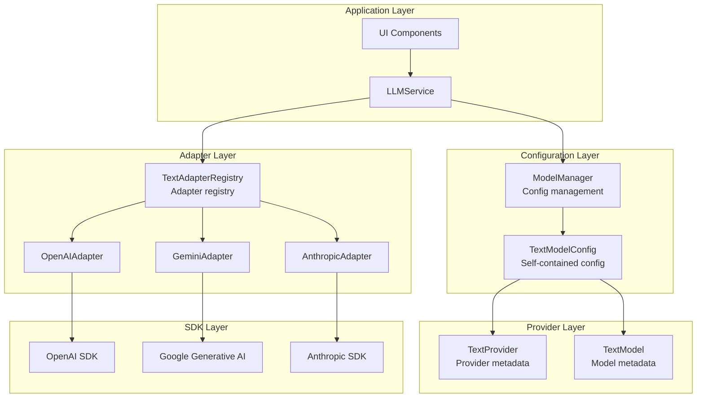
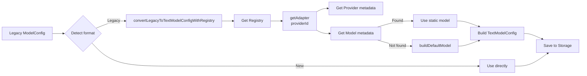

# LLM Service Architecture Refactoring Document

## Overview

This document describes the refactoring of Prompt Optimizer's LLM service architecture, moving from a monolithic Service to a three-layer **Provider-Adapter-Registry** architecture, achieving greater modularity, extensibility, and maintainability.

## Refactoring Goals

1. **Provider abstraction layer**: Unify the metadata definitions (capabilities, parameters, etc.) of the various LLM providers
2. **Unified Adapter interface**: Standardize how different SDKs are invoked and isolate SDK details
3. **Self-contained configuration**: Configuration contains complete metadata and does not rely on runtime lookups
4. **Backward compatibility**: Legacy configurations are converted automatically, and API signatures stay unchanged

## Architecture Design

### Three-Layer Architecture Diagram



### Core Components

#### 1. TextProvider (Provider Metadata)

```typescript
interface TextProvider {
  id: string;                    // 'openai' | 'gemini' | 'anthropic'
  name: string;                  // 'OpenAI' | 'Google Gemini' | 'Anthropic'
  description: string;
  defaultBaseURL?: string;
  connectionSchema: ConnectionSchema;  // Connection parameter definition
}
```

**Responsibility**: Define the Provider's basic information and connection requirements

#### 2. TextModel (Model Metadata)

```typescript
interface TextModel {
  id: string;                    // 'gpt-4o-mini' | 'gemini-2.0-flash-exp'
  name: string;
  description?: string;
  providerId: string;            // Owning Provider
  capabilities: {
    supportsStreaming: boolean;
    supportsTools: boolean;
    supportsReasoning: boolean;
    maxContextLength: number;
  };
  parameterDefinitions: ParameterDefinition[];
  defaultParameterValues: Record<string, any>;
}
```

**Responsibility**: Define the Model's capabilities and parameters

#### 3. TextModelConfig (Self-Contained Configuration)

```typescript
interface TextModelConfig {
  id: string;
  name: string;
  enabled: boolean;
  providerMeta: TextProvider;     // Embedded Provider metadata
  modelMeta: TextModel;            // Embedded Model metadata
  connectionConfig: ConnectionConfig;  // Connection config (apiKey, baseURL)
  paramOverrides: Record<string, any>; // Parameter overrides
}
```

**Characteristics**:
- **Self-contained**: Contains all the information needed at runtime
- **Type safe**: Complete TypeScript type definitions
- **Embedded metadata**: No runtime lookup of Provider/Model is needed

#### 4. ITextProviderAdapter (Adapter Interface)

```typescript
interface ITextProviderAdapter {
  getProvider(): TextProvider;
  getModels(): TextModel[];
  getModelsAsync?(config: TextModelConfig): Promise<TextModel[]>;
  buildDefaultModel(modelId: string): TextModel;

  sendMessage(messages: Message[], config: TextModelConfig): Promise<LLMResponse>;
  sendMessageStream(messages: Message[], config: TextModelConfig, handlers: StreamHandlers): Promise<void>;
  sendMessageStreamWithTools?(messages: Message[], config: TextModelConfig, tools: ToolDefinition[], handlers: StreamHandlers): Promise<void>;
}
```

**Responsibilities**:
- Provide Provider and Model metadata
- Encapsulate SDK invocation logic
- Handle message format conversion
- Preserve error stacks

#### 5. TextAdapterRegistry (Registry)

```typescript
class TextAdapterRegistry implements ITextAdapterRegistry {
  private adapters: Map<string, ITextProviderAdapter>;
  private staticModelsCache: Map<string, TextModel[]>;

  getAdapter(providerId: string): ITextProviderAdapter;
  getAllProviders(): TextProvider[];
  getStaticModels(providerId: string): TextModel[];
  getDynamicModels(providerId: string, config: TextModelConfig): Promise<TextModel[]>;
  getModels(providerId: string, config?: TextModelConfig): Promise<TextModel[]>;
}
```

**Responsibilities**:
- Register and manage all Adapter instances
- Provide a unified Adapter lookup interface
- Cache the static model lists
- Support dynamic model retrieval (OpenAI)

## Configuration Migration Flow

### Legacy Configuration → New Configuration



### Conversion Logic (converter.ts)

```typescript
export async function convertLegacyToTextModelConfigWithRegistry(
  key: string,
  legacy: ModelConfig,
  registry: ITextAdapterRegistry
): Promise<TextModelConfig> {
  // 1. Provider mapping
  const providerId = mapProviderToAdapterId(legacy.provider);

  // 2. Get the Adapter
  const adapter = registry.getAdapter(providerId);

  // 3. Get the Provider metadata
  const providerMeta = adapter.getProvider();

  // 4. Get the Model metadata
  let modelMeta = adapter.getModels().find(m => m.id === legacy.defaultModel);
  if (!modelMeta) {
    modelMeta = adapter.buildDefaultModel(legacy.defaultModel);
  }

  // 5. Build the TextModelConfig
  return {
    id: key,
    name: legacy.name,
    enabled: legacy.enabled,
    providerMeta,
    modelMeta,
    connectionConfig: {
      apiKey: legacy.apiKey,
      baseURL: legacy.baseURL
    },
    paramOverrides: legacy.llmParams || {}
  };
}
```

**Provider mapping rules**:
- `gemini` → `gemini` (GeminiAdapter)
- `anthropic` → `anthropic` (AnthropicAdapter)
- `openai` | `deepseek` | `zhipu` | `siliconflow` | `custom` → `openai` (OpenAIAdapter)

### When Automatic Conversion Happens

During `ModelManager.init()` initialization:

```typescript
async init(): Promise<void> {
  const existingModels = await this.getModelsFromStorage();

  for (const [key, existingModel] of Object.entries(existingModels)) {
    if (isLegacyConfig(existingModel)) {
      try {
        // Prefer conversion via the Registry
        const registry = await this.getRegistry();
        const convertedModel = await convertLegacyToTextModelConfigWithRegistry(
          key,
          existingModel,
          registry
        );
        updatedModels[key] = convertedModel;
        hasUpdates = true;
      } catch (error) {
        // Fall back to hard-coded conversion
        const convertedModel = convertLegacyToTextModelConfig(key, existingModel);
        updatedModels[key] = convertedModel;
      }
    }
  }

  // Save the converted configuration
  if (hasUpdates) {
    await this.saveModelsToStorage(updatedModels);
  }
}
```

## Service Layer Integration

### LLMService Uses the Registry

```typescript
export class LLMService implements ILLMService {
  constructor(
    private modelManager: ModelManager,
    private registry: ITextAdapterRegistry
  ) {}

  async sendMessage(messages: Message[], provider: string): Promise<string> {
    // 1. Get the configuration
    const config = await this.modelManager.getModel(provider) as TextModelConfig;

    // 2. Get the Adapter
    const adapter = this.registry.getAdapter(config.providerMeta.id);

    // 3. Call the Adapter
    const response = await adapter.sendMessage(messages, config);

    return response.content;
  }
}
```

**Key features**:
- Obtain the correct Adapter through `config.providerMeta.id`
- No switch/case on Provider type
- SDK invocation is fully encapsulated by the Adapter
- Error stacks are preserved

### Factory Function

```typescript
export function createLLMService(modelManager: ModelManager): ILLMService {
  if (isRunningInElectron()) {
    return new ElectronLLMProxy();
  }

  // Create the Registry instance
  const registry = new TextAdapterRegistry();

  // Inject the Registry into the Service
  return new LLMService(modelManager, registry);
}
```

## Developer Guide

### How to Add a New Provider

#### 1. Create the Adapter Implementation

```typescript
// packages/core/src/services/llm/adapters/example-adapter.ts
import { AbstractTextProviderAdapter } from './abstract-adapter';
import type { TextProvider, TextModel, TextModelConfig, LLMResponse, Message, StreamHandlers } from '../types';

export class ExampleAdapter extends AbstractTextProviderAdapter {
  getProvider(): TextProvider {
    return {
      id: 'example',
      name: 'Example Provider',
      description: 'Example LLM Provider',
      defaultBaseURL: 'https://api.example.com/v1',
      connectionSchema: {
        required: ['apiKey'],
        optional: ['baseURL'],
        fieldTypes: {
          apiKey: 'string',
          baseURL: 'url'
        }
      }
    };
  }

  getModels(): TextModel[] {
    return [
      {
        id: 'example-model-v1',
        name: 'Example Model V1',
        description: 'Fast and efficient model',
        providerId: 'example',
        capabilities: {
          supportsStreaming: true,
          supportsTools: false,
          supportsReasoning: false,
          maxContextLength: 8000
        },
        parameterDefinitions: [
          {
            name: 'temperature',
            type: 'number',
            description: 'Sampling temperature',
            min: 0,
            max: 2,
            default: 0.7
          }
        ],
        defaultParameterValues: {
          temperature: 0.7
        }
      }
    ];
  }

  protected async doSendMessage(
    messages: Message[],
    config: TextModelConfig
  ): Promise<LLMResponse> {
    // Implement the SDK invocation logic
    const client = new ExampleSDK({
      apiKey: config.connectionConfig.apiKey,
      baseURL: config.connectionConfig.baseURL || this.getProvider().defaultBaseURL
    });

    try {
      const response = await client.chat.completions.create({
        model: config.modelMeta.id,
        messages: messages,
        ...config.paramOverrides
      });

      return {
        content: response.choices[0].message.content || '',
        reasoning: undefined,
        metadata: {
          model: config.modelMeta.id,
          usage: response.usage
        }
      };
    } catch (error: any) {
      // Preserve the original error stack
      throw error;
    }
  }

  protected async doSendMessageStream(
    messages: Message[],
    config: TextModelConfig,
    handlers: StreamHandlers
  ): Promise<void> {
    // Implement the streaming invocation logic
    const client = new ExampleSDK({
      apiKey: config.connectionConfig.apiKey,
      baseURL: config.connectionConfig.baseURL
    });

    try {
      const stream = await client.chat.completions.create({
        model: config.modelMeta.id,
        messages: messages,
        stream: true,
        ...config.paramOverrides
      });

      for await (const chunk of stream) {
        const content = chunk.choices[0]?.delta?.content || '';
        if (content && handlers.onToken) {
          handlers.onToken(content);
        }
      }

      if (handlers.onComplete) {
        handlers.onComplete({ content: '', metadata: {} });
      }
    } catch (error: any) {
      if (handlers.onError) {
        handlers.onError(error);
      }
      throw error;
    }
  }
}
```

#### 2. Register with the Registry

```typescript
// packages/core/src/services/llm/adapters/registry.ts
import { ExampleAdapter } from './example-adapter';

export class TextAdapterRegistry implements ITextAdapterRegistry {
  private adapters: Map<string, ITextProviderAdapter>;

  constructor() {
    this.adapters = new Map();
    this.staticModelsCache = new Map();

    // Register all Adapters
    this.adapters.set('openai', new OpenAIAdapter());
    this.adapters.set('gemini', new GeminiAdapter());
    this.adapters.set('anthropic', new AnthropicAdapter());
    this.adapters.set('example', new ExampleAdapter());  // New
  }
}
```

#### 3. Update the Configuration Conversion Logic (if needed)

```typescript
// packages/core/src/services/model/converter.ts
function mapProviderToAdapterId(provider: string): string {
  switch (provider) {
    case 'gemini':
      return 'gemini';
    case 'anthropic':
      return 'anthropic';
    case 'example':  // New
      return 'example';
    case 'openai':
    case 'deepseek':
    case 'zhipu':
    case 'siliconflow':
    case 'custom':
    default:
      return 'openai';
  }
}
```

## Frequently Asked Questions (FAQ)

### Q1: Why refactor to the Adapter pattern?

**A**:
1. **Decouple SDKs**: The invocation logic of different SDKs is separated, making it easy to maintain and test
2. **Unified interface**: All Providers follow the same interface, simplifying the Service layer logic
3. **Extensibility**: Adding a new Provider only requires implementing an Adapter, with no change to the Service
4. **Testability**: Adapters can be mocked and tested independently

### Q2: How are legacy configurations migrated?

**A**: Migration is automatic and requires no manual action:
1. ModelManager detects legacy configurations during initialization
2. It automatically calls `convertLegacyToTextModelConfigWithRegistry()`
3. The converted configuration is saved to Storage
4. On the next load, it is recognized directly as the new format

### Q3: Why does TextModelConfig embed metadata?

**A**:
1. **Self-contained**: No runtime lookup of Provider/Model metadata is needed
2. **Type safe**: Complete type definitions and IDE IntelliSense
3. **Performance**: Avoids runtime lookups with direct access
4. **Traceable**: The configuration contains complete historical information

### Q4: How should SDK errors be handled?

**A**: Adapters must preserve the original error stack:

```typescript
try {
  const response = await sdk.call();
} catch (error: any) {
  // Throw directly, don't wrap it, to preserve the original stack
  throw error;
}
```

### Q5: How is dynamic model retrieval supported?

**A**: Implement the `getModelsAsync()` method:

```typescript
async getModelsAsync(config: TextModelConfig): Promise<TextModel[]> {
  const client = new OpenAI({
    apiKey: config.connectionConfig.apiKey,
    baseURL: config.connectionConfig.baseURL
  });

  const response = await client.models.list();

  return response.data.map(model => ({
    id: model.id,
    name: model.id,
    description: '',
    providerId: 'openai',
    capabilities: { /*...*/ },
    parameterDefinitions: [],
    defaultParameterValues: {}
  }));
}
```

The Registry automatically falls back to static models.

### Q6: What are the Provider mapping rules?

**A**:
- **Gemini**: `gemini` → GeminiAdapter (Google SDK)
- **Anthropic**: `anthropic` → AnthropicAdapter (Anthropic SDK)
- **OpenAI and compatible**:
  - `openai` → OpenAIAdapter
  - `deepseek` → OpenAIAdapter (OpenAI compatible)
  - `zhipu` → OpenAIAdapter (OpenAI compatible)
  - `siliconflow` → OpenAIAdapter (OpenAI compatible)
  - `custom` → OpenAIAdapter (OpenAI compatible)

## Testing Strategy

### Unit Tests

- **Adapter tests**: Mock the SDK and test data conversion and error handling
- **Registry tests**: Test Adapter registration, lookup, and caching logic
- **Conversion tests**: Test that the legacy configuration → new configuration mapping is correct

### Integration Tests

- **Adapter integration**: Test SDK invocation with real API keys
- **Migration integration**: Test automatic configuration conversion and persistence
- **Regression tests**: Verify that API signatures and behavior are unchanged

## Related Links

- [Requirements Document](../../.spec-workflow/specs/text-model-provider-refactor/requirements.md)
- [Design Document](../../.spec-workflow/specs/text-model-provider-refactor/design.md)
- [Tasks Document](../../.spec-workflow/specs/text-model-provider-refactor/tasks.md)
- [LLM Service Source](../../packages/core/src/services/llm/service.ts)
- [Adapter Directory](../../packages/core/src/services/llm/adapters/)
