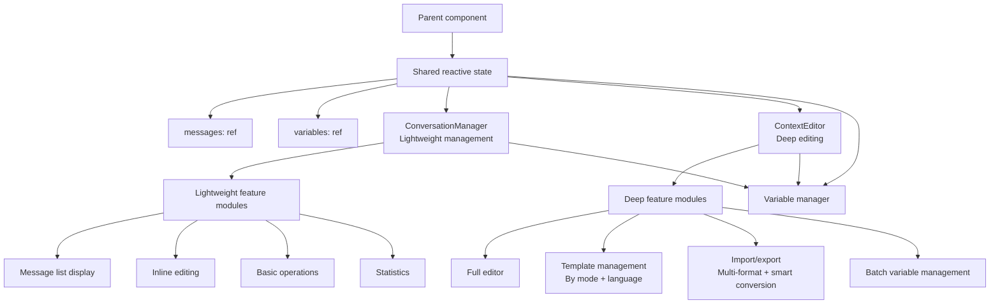

# Context Editor Refactor - Design Document

## Overview

This design document defines the technical implementation plan for refactoring the context editor architecture around a division of labor of "lightweight management in the main panel + deep management in the full-screen editor". The refactor removes the ConversationMessageEditor and ConversationSection components, simplifies ConversationManager into a lightweight management interface, enhances ContextEditor into a full-featured editor, and implements two-way data binding between the two.

## Alignment with Guiding Principles

### Technical Standards
- **Vue 3 Composition API**: use the Composition API and the reactivity system
- **Naive UI component library**: follow the existing Pure Naive UI design principle  
- **TypeScript type system**: strict type definitions and interface specifications
- **Single Responsibility Principle**: each component focuses on a specific functional domain

### Project Structure
- **Component modularity**: components are placed in the `packages/ui/src/components/` directory
- **Centralized types**: type definitions live in `packages/ui/src/types/components.ts`
- **Utility separation**: reusable logic is extracted into composables

## Code Reuse Analysis

### Existing Components to Keep
- **ContextEditor.vue**: keep the existing architecture and add template and import/export functionality
- **ConversationManager.vue**: simplify the existing implementation and remove complex features
- **Related composables**: `useResponsive`, `usePerformanceMonitor`, `useAccessibility`

### Components to Remove (After the Refactor Is Complete)
- **ConversationMessageEditor.vue**: functionality is merged into ConversationManager's inline editing
- **ConversationSection.vue**: over-abstracted; functionality is merged into its consumers

### Features to Port from the Backup Component
- **Template management**: port from ConversationManager.vue.backup to ContextEditor, categorized by optimization mode and language
- **Import/export**: port from ConversationManager.vue.backup to ContextEditor, supporting multiple formats and smart conversion  
- **Smart format conversion**: support for OpenAI, LangFuse, Conversation, Smart and other formats

### Integration Points
- **Variable system**: event communication with the existing variable manager
- **Reactivity system**: Vue's reactivity API implements two-way data binding
- **Theme system**: inherit the existing Naive UI theme configuration

## Architecture Design

### Modular Design Principles
- **Single-file responsibility**: ConversationManager focuses on lightweight management, ContextEditor focuses on deep editing
- **Component isolation**: the two components communicate loosely through a shared parent ref
- **Service layer separation**: data operations, business logic and presentation are clearly separated
- **Modular utilities**: variable scanning, template processing and so on are extracted into standalone utility functions

### Data Binding Architecture Diagram



## Components and Interfaces

### ConversationManager (After the Refactor)

#### Core Features
- **Compact message list display**: an inline editing interface suited to the limited space of the main panel
- **Inline message editing**: role selection + text input, integrating the basic editing functionality of ConversationMessageEditor
- **Basic operations**: add, delete and reorder messages
- **Statistics display**: counts of messages, variables and missing variables
- **Variable management integration**: statistics and missing-variable hints, events for quickly creating variables / opening the variable manager
- **Collapse feature**: saves space
- **Entry to open ContextEditor**: access to advanced features

#### Removed Features
- Quick template dropdown menu → moved to ContextEditor
- Import/export buttons → moved to ContextEditor
- Sync-to-test feature → deprecated

### ContextEditor (After Enhancement)

#### Retained Features
- **Tab architecture**: message editing / tool management tabs
- **Full editing features**: supports full editing, preview, and variable highlighting/replacement
- **Accessibility support**: keep the existing accessibility features

#### New Features
- **Template selection/preview/application**: template management categorized by optimization mode (system/user) and language
- **Import/export**: multi-format support, validation + sanitization, error messages
- **Smart conversion**: smart detection and conversion of OpenAI, LangFuse, Conversation, Smart and other formats
- **Batch variable processing**: validation and replacement, sharing the variable functions with the Manager

### Data Synchronization Mechanism

#### Two-way Binding Implementation
- **Shared data source**: Manager and Editor operate on the same parent refs (messages, variables)
- **v-model sync**: automatic synchronization through Vue's reactivity system
- **Real-time reflection**: a change in either component is immediately reflected in the other
- **No save needed**: no extra save step is needed when the Editor closes; all changes take effect in real time

#### Variable Management Integration
- **Manager responsibilities**: statistics and missing-variable hints, quickly creating variables, opening the variable manager
- **Editor responsibilities**: batch processing, deep editing, validation and replacement
- **Shared functions**: both components share the variable functions (scanVariables/replaceVariables/isPredefinedVariable)

## Data Model and API Design

### ConversationManager Props
```typescript
interface ConversationManagerProps extends BaseComponentProps {
  // Two-way binding data (operates directly on parent refs)
  messages: ConversationMessage[]
  availableVariables?: Record<string, string>
  
  // Functional functions (default implementations provided)
  scanVariables?: (content: string) => string[] // returns an empty array by default
  replaceVariables?: (content: string, variables?: Record<string, string>) => string // passes the content through by default
  isPredefinedVariable?: (name: string) => boolean // returns false by default
  
  // UI control
  title?: string
  readonly?: boolean
  collapsible?: boolean
  showVariablePreview?: boolean
  toolCount?: number
  maxHeight?: number // restricted to the number type; px is appended internally
}
```

### ConversationManager Emits
```typescript
interface ConversationManagerEvents extends BaseComponentEvents {
  // Data updates (v-model two-way binding)
  'update:messages': (messages: ConversationMessage[]) => void
  
  // Operation events  
  messageChange: (index: number, message: ConversationMessage, action: 'add' | 'update' | 'delete') => void
  messageReorder: (fromIndex: number, toIndex: number) => void
  
  // Navigation events
  openContextEditor: () => void
  createVariable: (name: string) => void
  openVariableManager: (variableName?: string) => void
}
```

### ContextEditor Props (New Additions to the Existing Ones)
```typescript
interface ContextEditorProps extends BaseComponentProps {
  // Existing properties
  visible: boolean
  state?: ContextEditorState
  showToolManager?: boolean
  
  // Two-way binding data
  messages: ConversationMessage[]
  variables: Record<string, string>
  
  // New feature controls
  optimizationMode?: 'system' | 'user' // used for template filtering
  enableTemplateManager?: boolean
  enableImportExport?: boolean
  
  // Pass-through functions (shared with ConversationManager)
  scanVariables?: (content: string) => string[]
  replaceVariables?: (content: string, variables?: Record<string, string>) => string
  isPredefinedVariable?: (name: string) => boolean
}
```

### ContextEditor Emits (Unchanged)
```typescript
interface ContextEditorEvents extends BaseComponentEvents {
  // UI state
  'update:visible': (visible: boolean) => void
  'update:state': (state: ContextEditorState) => void
  
  // Operation events
  save: (context: { messages: ConversationMessage[]; variables: Record<string, string> }) => void
  cancel: () => void
  
  // Variable management
  openVariableManager: (variableName?: string) => void
  createVariable: (name: string, defaultValue?: string) => void
}
```

## Concrete Implementation Strategy

### Phase 1: ConversationManager Simplification Refactor
1. **Simplify the UI**: remove the UI elements for templates, import/export and sync
2. **Integrate inline editing**: merge the basic editing functionality of ConversationMessageEditor into inline editing
3. **Optimize data binding**: operate directly on parent refs and implement v-model two-way binding
4. **Update the API**: refactor according to the new Props and Events specification
5. **Default values for functional functions**: provide default implementations for scanVariables and the like
6. **Reference the existing implementation**: reuse the editing logic of ConversationMessageEditor.vue

### Phase 2: ContextEditor Feature Enhancement  
1. **Template management integration**:
   - Add a template selection tab or functional area
   - Display templates categorized by optimizationMode and language
   - Implement template preview and application
   - Port the related logic from ConversationManager.vue.backup

2. **Import/export**:
   - Add import/export entries to the bottom action bar
   - Implement multi-format support (JSON, CSV, TXT, etc.)
   - Add data validation and sanitization
   - Provide friendly error messages

3. **Smart format conversion**:
   - Support the OpenAI API format
   - Support the LangFuse trace format
   - Support the standard Conversation format
   - Implement the Smart auto-detection mode

4. **Data binding alignment**: ensure two-way data synchronization with ConversationManager

### Phase 3: Data Binding Layer Implementation
1. **Shared state design**: create reactive messages and variables in the parent component
2. **v-model implementation**: the two child components bind to the parent's data through v-model
3. **Real-time sync verification**: ensure that changes in either component are reflected in the other in real time
4. **Shared variable functions**: ensure scanVariables, replaceVariables and the like behave consistently in both components
5. **Performance optimization**: use Vue's shallow reactivity to optimize rendering of large data

### Phase 4: Deprecated Component Cleanup
1. **Feature verification**: thoroughly test all functionality under the new architecture
2. **Component removal**: delete ConversationMessageEditor.vue and ConversationSection.vue
3. **Reference cleanup**: update all places that import and use these components
4. **Type definition update**: update the related interfaces in types/components.ts
5. **Final testing**: run a complete regression test

**Important note**: Throughout development, the deprecated components are kept for reference so that all functionality is migrated correctly. Component cleanup is performed in the final phase only after verifying that all functionality works.

## Event Naming Conventions

### Event Binding in Templates
```vue
<template>
  <!-- kebab-case is used in templates -->
  <ConversationManager 
    @open-context-editor="handleOpenEditor"
    @create-variable="handleCreateVariable"
    @open-variable-manager="handleOpenVariableManager"
  />
</template>
```

### TypeScript Type Definitions
```typescript
// camelCase is used in type definitions
interface ConversationManagerEvents {
  openContextEditor: () => void
  createVariable: (name: string) => void
  openVariableManager: (variableName?: string) => void
}
```

## Enhanced Error Handling

### Imported Data Handling
1. **Format validation**: strictly validate the structure and types of imported data
2. **Data sanitization**: clean potentially malicious content and invalid fields
3. **Error messages**: provide specific error information and repair suggestions
4. **Rollback mechanism**: keep the original data unchanged when an import fails

### Variable Handling Exceptions
1. **Scan exception**: fall back to basic text display when variable scanning fails
2. **Replacement exception**: keep the original placeholder when variable replacement fails
3. **Circular reference detection**: prevent infinite loops in variable replacement
4. **Performance protection**: limit the complexity and time of variable scanning

## Testing Strategy

### Unit Test Focus
- ConversationManager inline editing
- ContextEditor template management and import/export  
- Synchronization logic of two-way data binding
- Default implementations and shared logic of the variable functions
- Accuracy of smart format conversion

### Integration Test Focus
- Real-time data synchronization between Manager and Editor
- The effect of template application on data
- The complete import/export workflow
- Cross-component collaboration in variable management

### End-to-End Test Scenarios
- The user flow from lightweight management to deep editing
- Selecting and applying complex templates
- Importing, exporting and converting multi-format data
- Creating and managing large numbers of variables

## Performance Considerations

### Rendering Optimization
- Use shallowRef to optimize the reactive performance of large numbers of messages
- Lazy loading of template and import/export features
- Virtual scrolling support (if needed)

### Memory Management
- Clean up references to deprecated components promptly
- Optimize reactive watchers for two-way binding
- Avoid memory leaks caused by circular references

### User Experience
- Maintain smooth 60fps interaction
- Real-time response in data synchronization
- Batch processing and progress hints for large data imports
